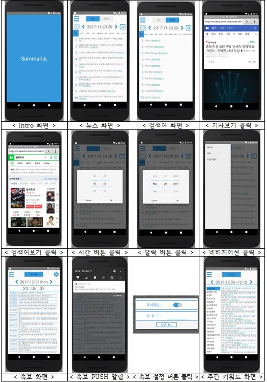

### Summarist (2017.11.21~2017.12.04)
---
 - 프로젝트 소개
   - Summary + List = Summarist
   >- 하루의 주요 뉴스 기사와 검색어를 요약하여 리스트화해서 보여준다는 의미
   - 기능
   >- 1시간 단위로 뉴스와 검색어의 종합 및 컨텐츠별 순위 1~10위까지 display
   >- 원하는 키워드의 속보 발생시 Push 알림
   >- 주간 키워드 1~20위별 뉴스 기사 30개씩 display
   - 이미지
   >- 
   >- [상세이미지](https://github.com/jo-bata/Summarist/tree/master/readme_image)
