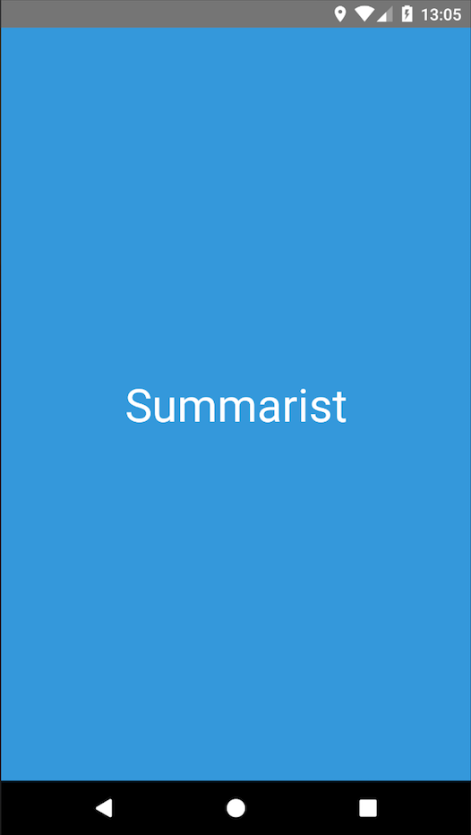
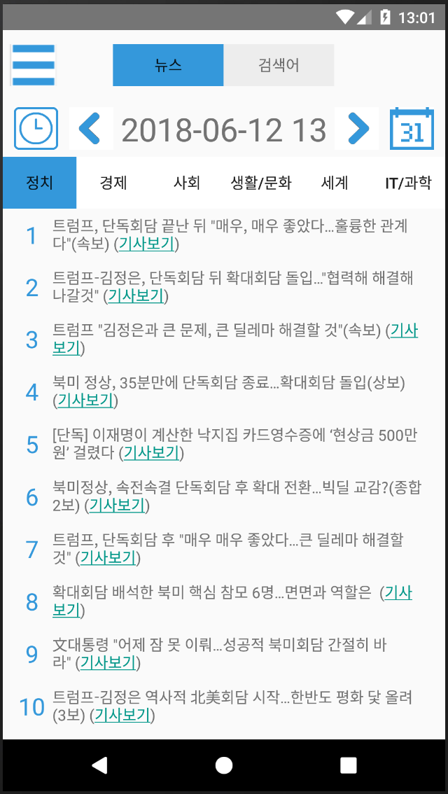
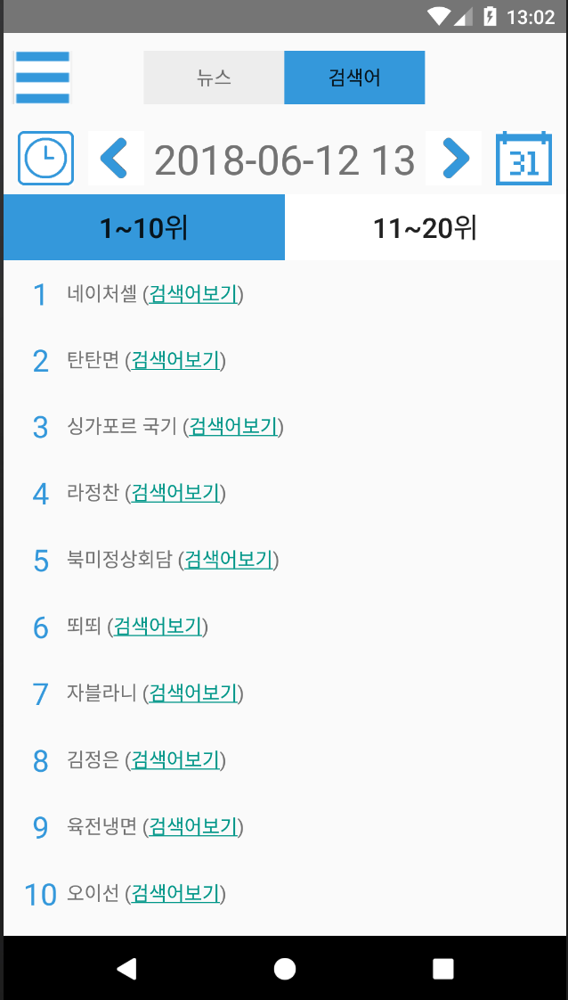
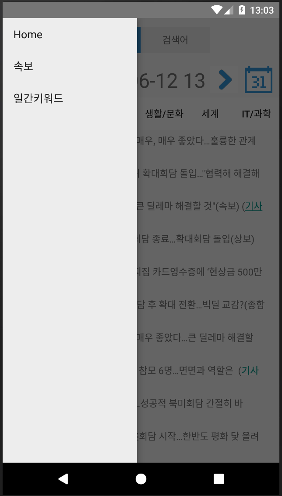
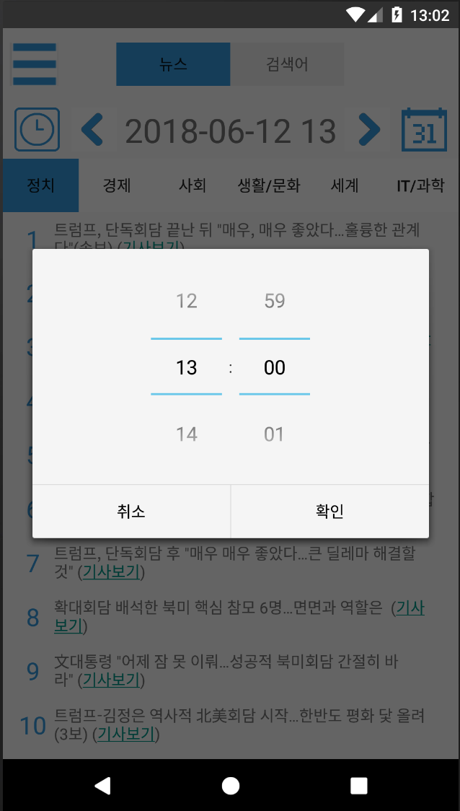
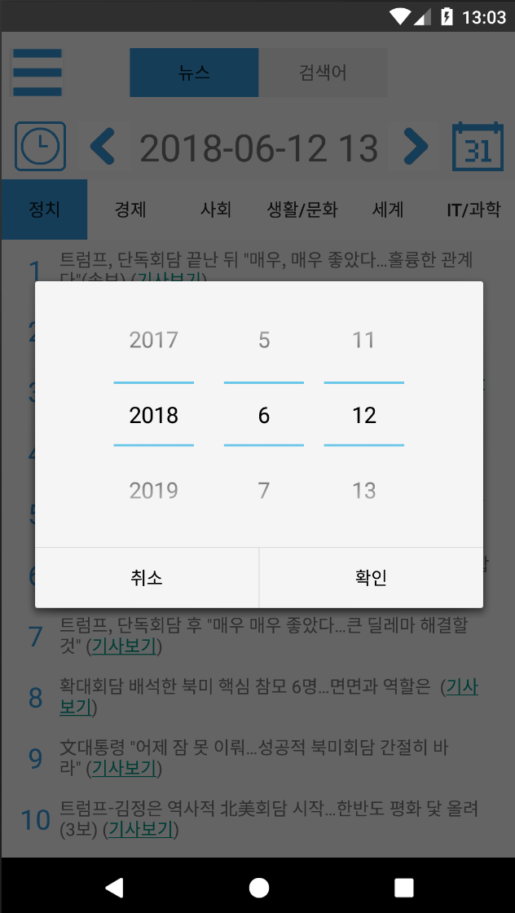
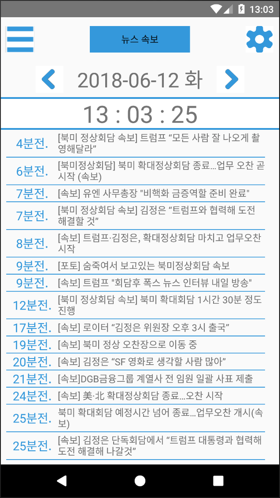
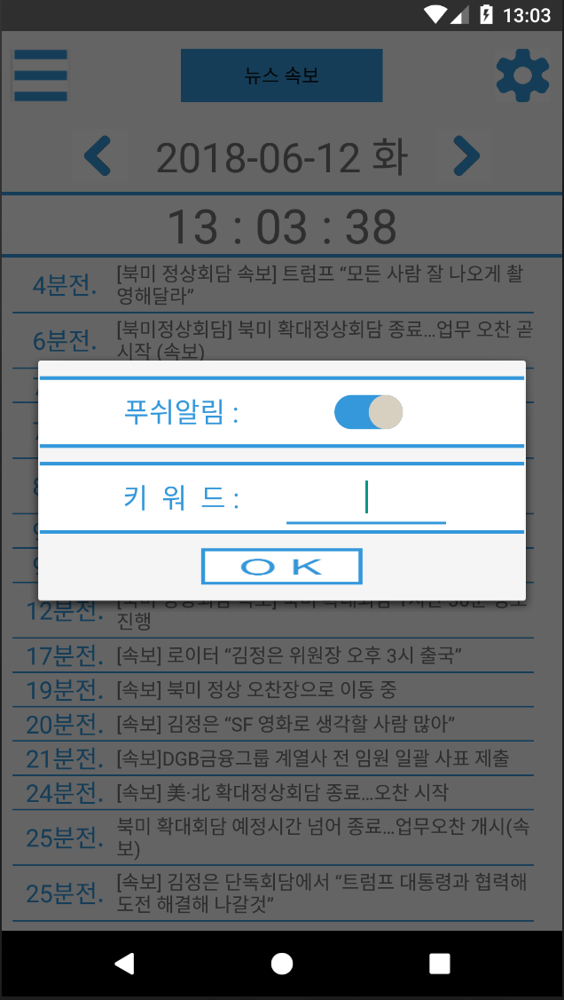
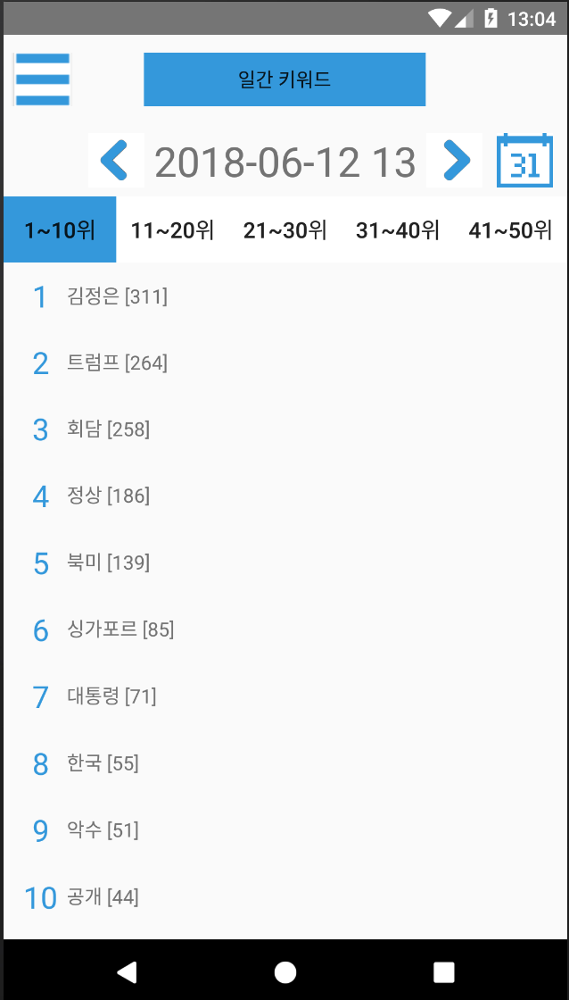
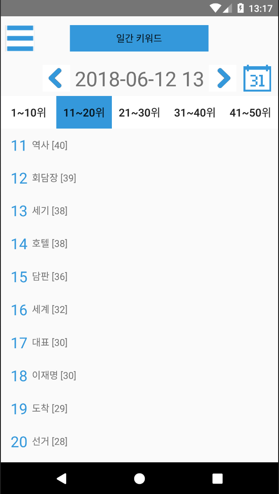

# Summarist

## About
- 개요
  - 주요 시사를 편리하게 접할 수 있는 모바일 어플리케이션
  - Summarist(Summary + List)
    - 요약하여 리스트화해서 보여준다는 의미
- 배경
  - 바쁘게 하루를 살다보면 그 당시 이슈가 된 검색어와 뉴스 기사들을 접하기 어렵습니다.
  - 이에 일일이 찾아보지 않아도 주요 시사를 편리하게 접할 수 있는 모바일 어플리케이션을 만들고자 했습니다.
- 기능
  1. 일자와 시간대별로 화제가 되었던 검색어와 뉴스 기사들을 모아서 한눈에 볼 수 있습니다.
      - 네이버 DataLab의 정보를 기준으로 합니다.
  2. 원하는 키워드의 뉴스 속보를 push 알림으로 받아 볼 수 있습니다.
      - 속보를 1분마다 insert 시키는데 중복이 있는지 속보 제목의 단어들을 비교하고 그 단어들의 음절을 또 다시 비교하는 알고리즘을 만들어 중복을 최소화하여 저장합니다.
  3. 당일 이슈가 되었던 키워드들의 순위를 보여줍니다.
      - 10개의 주요 신문사의 오늘자 기사들을 실시간으로 모두 수집하여 제목들을 형태소 분석한 후 고유명사와 일반명사를 word county합니다.
- 기간
  - 2018.03.16 ~ 2018.06.15
- 관련기술
  - Android, MySQL, Node.js, Firebase

## Preview
|  |  |  |  |
|:---:|:---:|:---:|:---:|
|  |  |  |  |
|  |  |  |  |
